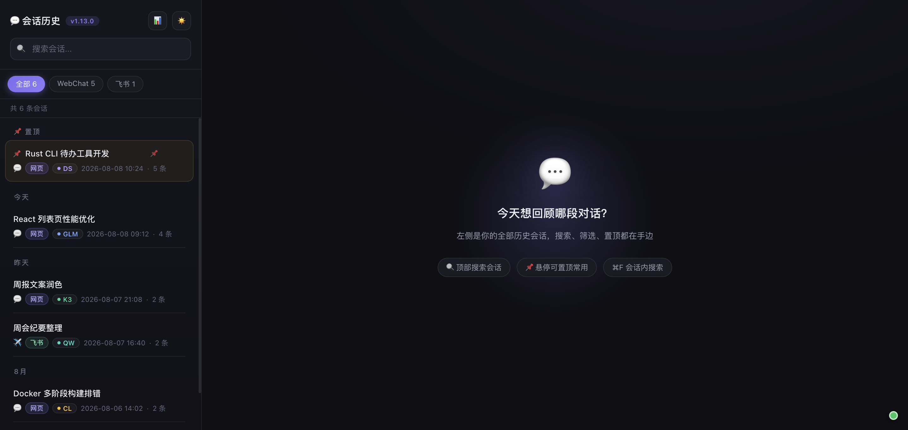
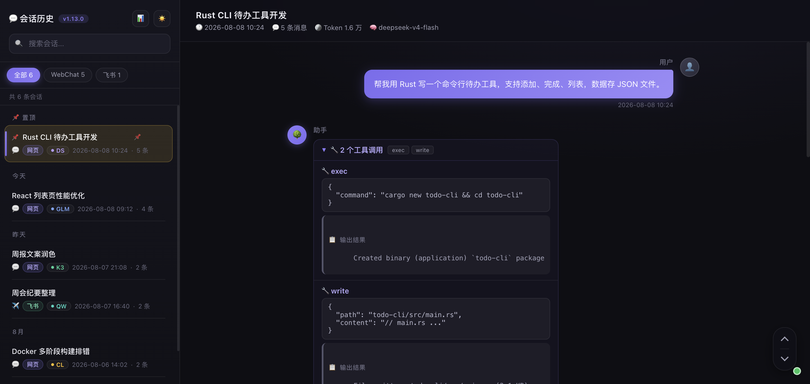
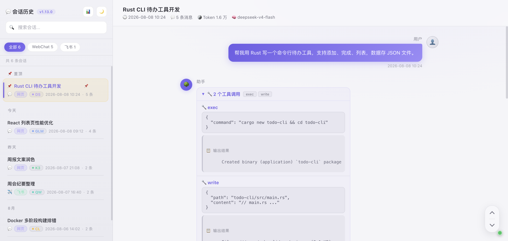
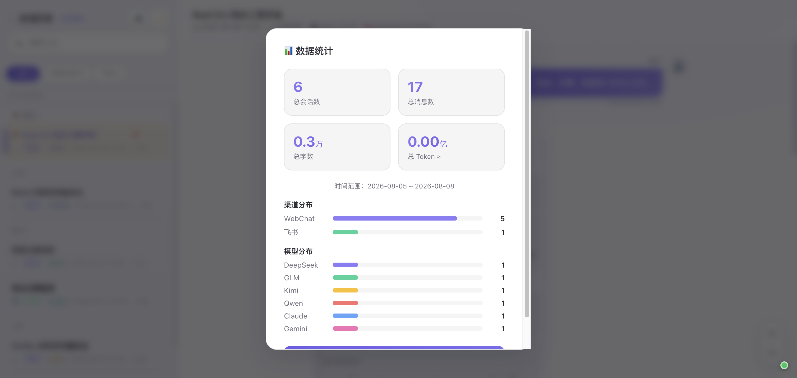

# 💬 Session Gallery · 历史会话浏览器

> 浏览 OpenClaw 所有历史会话：搜索、查看完整对话、AI 自动标题、手动编辑、置顶、删除。
> 深空紫双主题界面（深色 / 低饱和浅色一键切换）。
> 当前版本：v1.13.1

## 界面预览

| 深色主题 · 会话列表 | 深色主题 · 对话详情 |
|---|---|
|  |  |

| 浅色主题 · 对话详情 | 浅色主题 · 数据统计 |
|---|---|
|  |  |

> 截图中的会话内容均为虚构演示数据。

## 功能一览

| 功能 | 一句话说明 |
|------|-----------|
| 📋 会话浏览 | 时间倒序 + 日期分组（今天/昨天/月份），滚动自动加载 |
| 📌 收藏置顶 | 重要会话一键置顶，置顶区淡琥珀色整体显示 |
| 🔍 全文搜索 | 标题 + 消息内容输入即搜，秒出结果，品牌紫高亮 |
| ⌨️ 内容搜索 | 对话内 Cmd+F，实时高亮 + 计数 + 上下导航 |
| 🤖 AI 自动标题 | 根据前 6 条消息自动生成 5-15 字标题，永久保存 |
| ✏️ 标题双向同步 | 手动改名与 OpenClaw 双向同步，单一数据源不打架 |
| 🏷️ 类型筛选 | 全部 / 网页对话 / 飞书，一键切换 |
| 📊 数据统计 | 会话数 / 消息数 / 字数 / Token，渠道与模型分布图 |
| 🌗 深浅双主题 | 深空紫深色 + 低饱和浅色，一键切换、记忆选择 |
| 🗑️ 会话删除 | 一键清理 session 及相关文件（不可恢复） |

## 功能说明

### 一、会话列表（左侧栏）

- 按时间倒序排列所有真实对话（自动过滤纯自动任务：cron/子agent/dreaming/空会话）
- **日期分组**：今天 / 昨天 / 自然月（近3个月）/ 更早
- **收藏置顶**：hover 出现 📌 按钮置顶，置顶区域淡琥珀色整体显示
- 每条显示：标题、时间、消息数、来源图标（💬网页/✈️飞书）、类型标签、模型标签
- **标题单一数据源（v1.9.0+）**：会话标题以 OpenClaw sessions.json 为权威。画廊显示优先级：手动改过的标题（任一侧）> OpenClaw 标题 > 首条用户消息兜底
- **双向同步**：画廊手动改名 → 同步写 OpenClaw 的 label + displayName；OpenClaw 侧改名 → 画廊刷新时自动发现并收敛镜像表（titles.json）
- **AI 自动生成标题（v1.10.0）**：用前 6 条消息调模型总结（5-15 字），只写入画廊 titles.json，**不同步 OpenClaw**——避免 AI 标题污染 OpenClaw 原生命名
- 搜索也覆盖 OpenClaw 标题
- 滚动到底部自动加载更多（每页 50 条）
- 类型筛选：全部 / 网页对话 / 飞书

### 二、搜索

- 左上角搜索框，输入即搜
- 全文搜索：匹配标题 + 消息内容
- 所有文本加载在内存里，搜索不读文件，秒出结果
- **搜索高亮**：列表标题和聊天内容均以品牌紫高亮，当前命中项加深显示
- **内容搜索（Cmd+F）**：右侧聊天区按 Cmd/Ctrl+F 唤出搜索栏，实时高亮+计数+上下导航，Enter下一个/Shift+Enter上一个，自动展开折叠框定位

### 三、查看对话详情

- 点击左侧任意会话，右侧展示完整对话
- 用户消息在右（品牌紫渐变气泡 + 发光投影），助手消息在左（浮层卡片气泡 + 圆形头像）
- **工具调用**：连续的工具消息合并成折叠框（淡紫色），点击展开看参数
- **思考过程**：折叠框（青色指示条样式），点击展开
- **Markdown 渲染**：表格、代码块、粗体、列表、链接、引用、分割线均正常显示
- **滚动导航**：右下角胶囊式悬浮按钮（上 / 下细线箭头），常驻显示
- 消息出现时有淡入上浮动画，列表项 hover 有右移反馈

### 四、界面主题（v1.11.0+）

- **深空紫深色主题（默认）**：一体化深色空间，单品牌紫 + 中性灰阶 + 三级阴影
- **低饱和浅色主题**：薰衣草灰调，适合白天长时间阅读
- 标题栏 ☀️/🌙 按钮一键切换，选择记忆在 localStorage，首次渲染前应用不闪烁
- 全套设计令牌（双主题变量）在 `:root` 与 `[data-theme="light"]` 中，可直接移植到其他项目

### 五、数据统计

- 点击标题栏 📊 图标弹出统计面板
- 4 个卡片：总会话数 / 总消息数 / 总字数（万）/ 总 Token 数
- 渠道分布柱状图（WebChat / 飞书 / 定时任务）
- 模型分布柱状图（DeepSeek / GLM / Qwen / …）
- 时间范围显示

### 六、标题管理

- **AI 自动生成**：首次打开无标题的会话，后端调 AI 根据前 6 条消息生成 5-15 字标题，保存后永久固定
- **手动编辑**：鼠标移到会话上，点 ✏️ 按钮编辑标题，Enter 保存
- 标题存在 `titles.json`，重启不丢

### 七、删除会话

- 鼠标移到会话上，点 🗑️ 按钮删除
- 会同时清理 session 文件 + trajectory + path + 相关 reset/bak 文件
- ⚠️ 不可恢复，删之前确认好

## 快速启动

```bash
git clone https://github.com/jiamuAi/openclaw-chat-history.git
cd openclaw-chat-history
python3 server.py
```

浏览器打开 `http://localhost:18923/`

**运行要求**：Python 3 标准库即可，无第三方依赖；本机已安装 OpenClaw（会话数据读取自 `~/.openclaw/agents/*/sessions/`）。

## 配置（可选）

应用开箱即用。如需个性化，复制配置模板为本地配置（`config.local.json` 不会被 Git 跟踪）：

```bash
cp config.example.json config.local.json
```

| 字段 | 默认值 | 说明 |
|------|--------|------|
| `extraSessionDirs` | `[]` | 额外的 OpenClaw agent 会话目录（`main` 默认包含）。例如 `["~/.openclaw/agents/my-agent/sessions"]` |
| `assistantName` | `"助手"` | 聊天界面中助手的显示名 |
| `userName` | `"用户"` | 聊天界面中用户的显示名 |
| `autoTitleModel` | `"glm-4-flash"` | AI 自动标题使用的模型（`openclaw infer` 的 `--model` 参数） |

## 文件说明

| 文件 | 作用 |
|------|------|
| `server.py` | Python HTTP 服务器（后端），端口 18923，仅监听 localhost |
| `trajectory_parser.py` | Trajectory 解析 + 缓存模块 |
| `index.html` | 前端页面（纯 HTML/CSS/JS，无框架） |
| `marked.min.js` | Markdown 渲染库（本地） |
| `config.example.json` | 配置模板（复制为 `config.local.json` 后个性化） |
| `titles.json` | 标题持久化（本地生成，不发布） |
| `pinned.json` | 置顶会话列表（本地生成，不发布） |
| `.cache/` | Trajectory 解析缓存（自动生成，mtime 失效） |

## 数据源

读取 OpenClaw 的 session 文件（默认 `~/.openclaw/agents/main/sessions/`，可通过 `extraSessionDirs` 增加其他 agent）。

支持的文件类型：

| 类型 | 处理方式 |
|------|---------|
| `.jsonl`（正常/.bak/.deleted/.reset/.checkpoint） | 直接读取 |
| `.trajectory.jsonl`（正常/.deleted） | trajectory_parser 解析（仅在没有 .jsonl 时） |
| `.trajectory-path.json` | 跳过（纯路径索引，无对话内容） |

不修改原始文件，只读取。删除操作除外（会删原始 session 文件）。

## 安全说明

- 服务仅监听 `localhost`，不对外暴露
- 静态文件服务使用白名单（仅 `index.html` / `marked.min.js`），数据文件无法通过 HTTP 下载
- 已防护路径穿越（`GET /../../etc/passwd` 类请求返回 403）
- 修改类操作（自动标题）仅接受 POST，GET 无副作用

## 技术栈

- **后端**：Python 3 标准库（http.server），无第三方依赖
- **Trajectory 解析**：`trajectory_parser.py`，带磁盘缓存（218x 加速）
- **前端**：纯 HTML/CSS/JS，无框架
- **Markdown**：marked.js
- **AI 标题**：调用 `openclaw infer` CLI

## 常见问题

**Q: 重启电脑后服务没了？**
A: 服务是手动启动的，重新跑 `python3 server.py` 即可。

**Q: 新产生的会话会自动出现吗？**
A: 会。每次刷新页面时后端自动检查新文件，增量加入列表。

**Q: 标题生成失败怎么办？**
A: 标题生成失败会 fallback 到取第一条用户消息前 50 字。可以手动点 ✏️ 修改。如果一直失败，检查 `autoTitleModel` 配置的模型是否可用。

**Q: 搜索能搜中文吗？**
A: 能，大小写不敏感，中英文都支持。

**Q: 为什么有些会话只有飞书标签没有网页标签？**
A: 这些是飞书渠道的会话，部分只有 `.trajectory.jsonl` 没有 `.jsonl` 文件，属于 OpenClaw 正常行为，Gallery 会通过 trajectory 解析恢复内容。
